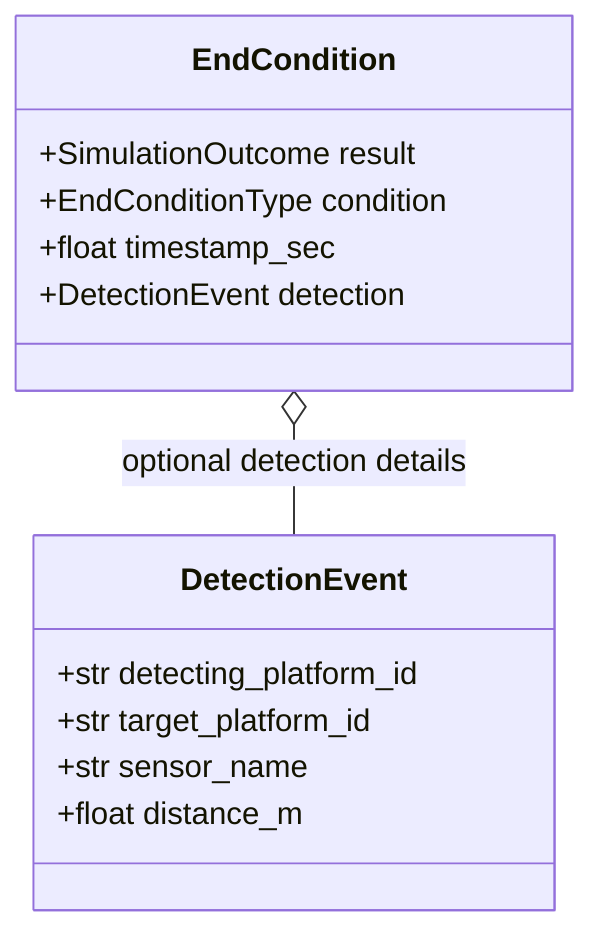
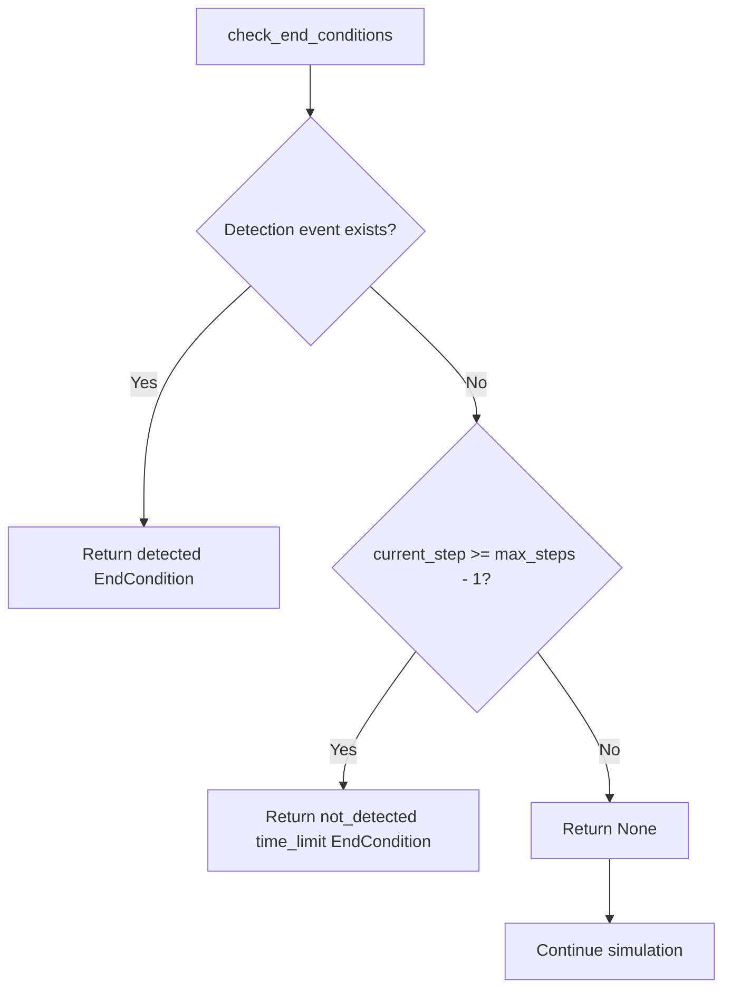
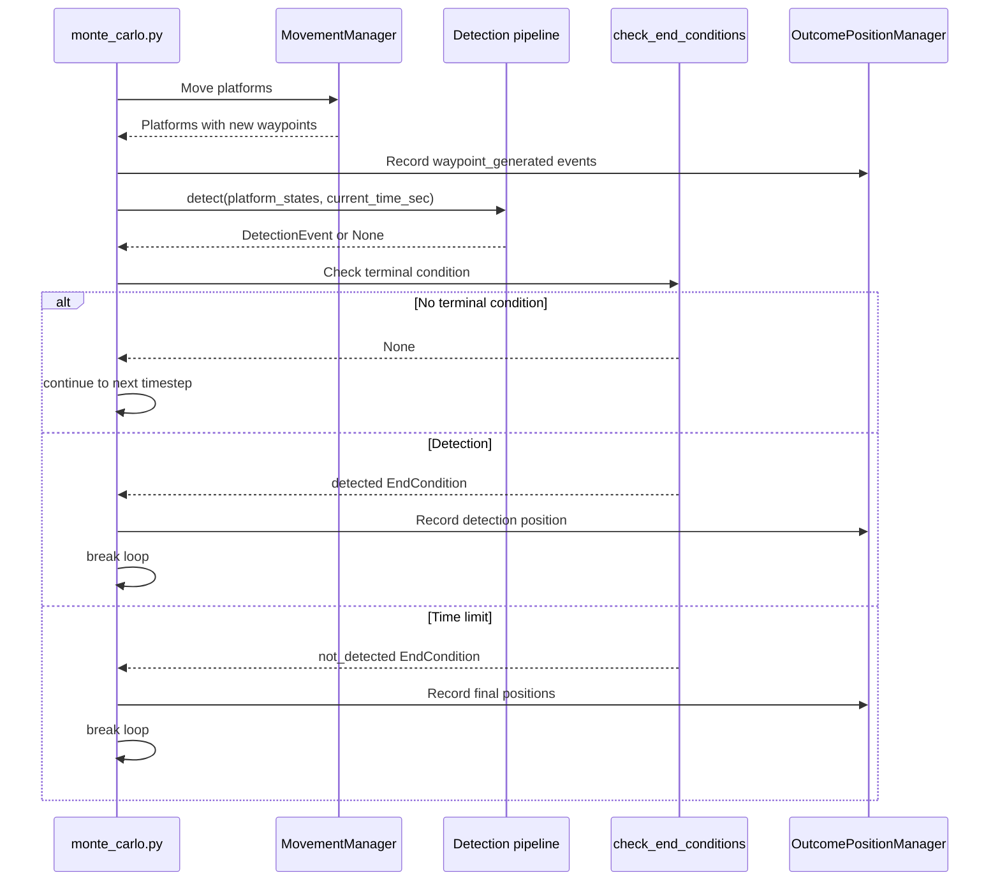
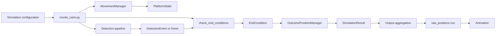

# EndCondition

## Purpose

`EndCondition` represents the single terminal condition reached by one Monte Carlo replication.

The current simulation has two possible terminal outcomes:

- `detected`: a detection occurred before or on the final timestep;
- `not_detected`: the simulation reached its time limit without a detection.

The end-condition module decides whether the replication should continue or stop. It does not move platforms, run detection rules, or record output events.

## Design

The implementation is in `src/monte_carlo/end_conditions.py` and contains:

- `EndConditionType`: the terminal causes currently supported;
- `SimulationOutcome`: the two public simulation results;
- `EndCondition`: an immutable dataclass describing the terminal state;
- `check_end_conditions(...)`: the decision function used by the simulation loop.



`EndCondition` is frozen so that the terminal result cannot be changed after it has been created.

## Supported values

```text
EndConditionType = "detection" | "time_limit"
SimulationOutcome = "detected" | "not_detected"
```

Examples:

```python
EndCondition(
    result="detected",
    condition="detection",
    timestamp_sec=120.0,
    detection=detection_event,
)
```

```python
EndCondition(
    result="not_detected",
    condition="time_limit",
    timestamp_sec=600.0,
)
```

The `result` describes the outcome from the user's perspective. The `condition` explains why the simulation stopped.

## `check_end_conditions`

The function signature is:

```python
def check_end_conditions(
    *,
    current_time_sec: float,
    current_step: int,
    max_steps: int,
    detection: DetectionEvent | None = None,
) -> EndCondition | None:
```

The `*` makes all arguments after it keyword-only. This is intentional because `current_time_sec`, `current_step`, and `max_steps` are all numeric values that could be passed in the wrong order. The call must therefore be explicit:

```python
end_condition = check_end_conditions(
    current_time_sec=sim_time_sec,
    current_step=step,
    max_steps=max_steps,
    detection=detection,
)
```

The function returns:

- an `EndCondition` when the replication must stop;
- `None` when the replication should continue.

It does not perform side effects.

## Decision order

Detection has priority over the time limit. This matters when a detection occurs on the final allowed timestep: the result must be `detected`, not `not_detected`.



The final loop index is `max_steps - 1` because Python's `range(max_steps)` starts at zero.

## Integration with `monte_carlo.py`

The simulation orchestrator owns the timestep loop. Its responsibilities are:

1. advance simulation time;
2. move platforms;
3. record newly generated waypoint events;
4. call the detection pipeline;
5. call `check_end_conditions()`;
6. record the event associated with the terminal condition;
7. exit the loop when an `EndCondition` is returned;
8. build the `SimulationResult`.



The relevant control flow is:

```python
if end_condition is None:
    continue

if end_condition.condition == "detection":
    # Record the detecting platform and detection metadata.
    ...
elif end_condition.condition == "time_limit":
    # Record every platform's final position.
    ...

break
```

`continue` starts the next timestep. `break` exits the replication's timestep loop entirely.

## Recording rules

`EndCondition` decides what happened. `OutcomePositionManager` records the associated platform state.

### Detection

When the condition is `detection`:

1. use the `DetectionEvent` to identify the detecting platform;
2. find that platform in `platform_states`;
3. record its current position and detection metadata;
4. break the timestep loop.

No time-limit events should be recorded after a detection.

### Time limit

When the condition is `time_limit`:

1. record the final position of every platform;
2. break the timestep loop;
3. return `not_detected`.

Time-limit recording must occur inside the `time_limit` branch rather than unconditionally after the loop. Otherwise a detection would incorrectly produce both detection and time-limit events.

## Overall project flow



Component responsibilities remain separate:

| Component | Responsibility |
|---|---|
| `MovementManager` | Generate waypoints and update platform movement |
| Detection pipeline | Determine whether a detection occurred |
| `check_end_conditions()` | Decide whether the replication continues or terminates |
| `EndCondition` | Describe the terminal result and cause |
| `OutcomePositionManager` | Capture immutable platform position snapshots |
| Output aggregation | Convert snapshots to CSV columns and units |

## Replication invariant

Every replication must finish with exactly one terminal `EndCondition`:

```text
Detection found
    -> result = detected
    -> condition = detection

No detection by max_steps
    -> result = not_detected
    -> condition = time_limit
```

If the timestep loop finishes without an end condition, that indicates a simulation-control bug. The current orchestrator uses an assertion after the loop to enforce this invariant.

## Future extensions

Additional terminal conditions can be added later by extending `EndConditionType` and the decision logic. Examples might include barrier crossing or world boundary crossing. Each new condition should define:

1. its terminal condition value;
2. its public result, if different from the current two outcomes;
3. its precedence relative to detection and time limit;
4. the position event that should be recorded;
5. focused tests for the final-timestep and competing-condition cases.
