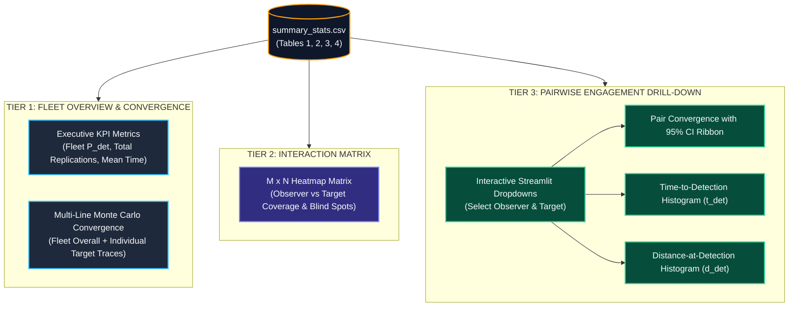

# Architecture Decision Record (ADR): Monte Carlo Detection Analytics & Convergence Framework

## Status
**Accepted & Implemented**

## Context & Problem Statement

In Monte Carlo agent-based simulations, evaluating sensor detection efficacy across stochastic replications is a foundational requirement. Prior to this design, the simulation output presented summary statistics solely through raw tabular CSV structures (`summary_stats.csv`) and animated trajectories.

While tabular averages (such as mean $P_{\text{det}}$, mean detection range, and mean detection time) convey static numerical results, they suffer from three critical post-analysis deficiencies:

1. **Absence of Convergence Verification**: A static average (e.g. $P_{\text{det}} = 0.572$) provides no evidence that the replication count ($R$) was statistically sufficient. Without a running convergence trajectory, analysts cannot determine whether the estimate has stabilised asymptotically or remains dominated by stochastic noise.
2. **Combinatorial Explosion in Multi-Agent Runs**: In $1\text{-vs-}1$ scenarios, visualizing performance is trivial. However, when evaluating $M$ detecting platforms against $N$ hostile targets ($M \times N$ interactions), generating separate individual graphs results in visual clutter and cognitive overload.
3. **Loss of Temporal & Spatial Distribution**: Averages mask operational realities. A mean detection time of 112 minutes could indicate a tight unimodal cluster around 112 minutes, or a bimodal distribution with half the detections occurring at 10 minutes (early warning) and half at 214 minutes (late-stage penetration).

---

## The 3-Tier Analytical Framework

To address these challenges, we designed and implemented a **hierarchical 3-tier post-analysis framework** that bridges executive mission-level conclusions, tactical network coverage, and engagement physics:



---

## Analytical Purpose: What Each Tier Shows for Post-Analysis

### Tier 1: Fleet Overview & Monte Carlo Convergence
* **Primary Question**: *Did the sensor network meet the mission requirement, and has the simulation mathematically converged?*
* **Mathematical Formulation**:
  $$\hat{P}_{\text{det}}(N) = \frac{1}{N} \sum_{i=1}^{N} \mathbb{I}(\text{detected}_i) \quad \text{for } N = 1, 2, \dots, R$$
* **Post-Analysis Insights**:
  - **Sample Size Validation**: Shows the cumulative empirical detection probability as replications accumulate ($1 \dots R$). Early iterations exhibit high stochastic oscillation; as $N \to R$, the curve flattens into an asymptote. If the trajectory is still fluctuating at $R$, the analyst knows the sample size must be increased.
  - **Cross-Threat Comparison**: Compares the survivability/detectability of different threat trajectories (`Red_1` vs `Red_2`) on a single chart alongside the combined Fleet curve.
* **Operational Decision**: Validates formal mission pass/fail requirements (e.g. $P_{\text{det}} \ge 0.80$) and confirms sample size defensibility for technical reports.

### Tier 2: Interaction Matrix ($M \times N$ Heatmap)
* **Primary Question**: *Which defender is doing the heavy lifting, who is redundant, and where are the tactical blind spots?*
* **Post-Analysis Insights**:
  - **Coverage Gaps & Blind Spots**: A cross-platform heatmap maps detecting agents on the Y-axis and hostile targets on the X-axis, with cell intensity representing $P_{\text{det}}$. Targets with near-zero detection across all defenders highlight unmonitored ingress corridors.
  - **Asset Redundancy**: If multiple observers exhibit high detection against the same target, overlapping coverage exists (resilience against platform attrition). If an observer has zero detections across all targets, its patrol sector is ineffective.
* **Operational Decision**: Rebalance patrol paths, shift barrier dimensions, or reallocate sensor payloads to plug coverage holes.

### Tier 3: Pairwise Engagement Drill-Down & Histograms
* **Primary Question**: *How, when, and under what geometric conditions did a specific defender detect a specific target?*
* **Post-Analysis Insights**:
  - **Time-to-Detection ($t_{\text{det}}$) Distribution**: Identifies early warnings (e.g. $t = 20\text{ min}$) versus late-stage penetration detections (e.g. $t = 250\text{ min}$). Multimodal distributions reveal multiple encounter regimes (e.g. detection on approach versus detection during retreat).
  - **Distance-at-Detection ($d_{\text{det}}$) Distribution**: Demonstrates whether detections occur at maximum instrumented range (optimal performance) or close-in (suggesting sensor FOV or $K$-of-$N$ confirmation latency).
  - **Pairwise 95% Confidence Interval**:
    $$\text{CI}_{95\%} = \hat{p} \pm 1.96 \sqrt{\frac{\hat{p}(1 - \hat{p})}{N}}$$
    Visualised as a shaded ribbon that narrows as $N$ increases, demonstrating confidence bounds for specific tactical pairings.
* **Operational Decision**: Fine-tune sensor parameters ($K$-of-$N$ sliding window depth, FOV limits, integration timestep) and platform transit velocities.

---

## Technical Implementation Architecture

The feature follows strict architectural separation of concerns:

```
┌──────────────────────────────────────────────────────────────┐
│                  Presentation Layer (UI)                     │
│  src/ui/views/results.py                                     │
│  - Streamlit Tab: "Analytics & Convergence"                  │
│  - Reactive KPI metric cards                                 │
│  - Streamlit filter dropdowns (Observer & Target)            │
└──────────────────────────────┬───────────────────────────────┘
                               │ Calls pure figure builders
┌──────────────────────────────▼───────────────────────────────┐
│               Visualisation Engine (Plotting)                │
│  src/ui/plotting/detection_analytics.py                      │
│  - compute_running_probability()                             │
│  - build_fleet_convergence_chart()                           │
│  - build_interaction_heatmap()                              │
│  - build_pairwise_convergence_chart()                        │
│  - build_detection_histogram()                               │
└──────────────────────────────┬───────────────────────────────┘
                               │ Reads structured DataFrames
┌──────────────────────────────▼───────────────────────────────┐
│                  Data Access Layer (Services)                │
│  src/ui/services/results_data.py                             │
│  - load_summary_stats_tables()                               │
│  - Parsed sections: Tables 1, 2, 3, and 4                   │
└──────────────────────────────────────────────────────────────┘
```

### Key Modules

1. **`src/ui/plotting/detection_analytics.py`**:
   - **Pure Plotly figure builders**: Zero Streamlit or file I/O dependencies. Operates strictly on Pandas DataFrames and returns `plotly.graph_objects.Figure` instances. This enables reuse in automated report generation, CLI tools, and Jupyter notebooks.
   - **Confidence Ribbon Calculation**: Implements running Wilson/Normal approximation confidence intervals with lower and upper clipping in $[0.0, 1.0]$.
   - **Dynamic Heatmap Generation**: Automates matrix pivot tables from Section 1 of `summary_stats.csv` and embeds formatted text annotations (`XX.X%`).

2. **`src/ui/views/results.py`**:
   - Integrates the new **"Analytics & Convergence"** tab into the Streamlit results view.
   - Provides reactive filtering without re-reading files from disk.
   - Handles edge cases (zero detections, single-agent scenarios, missing sensor columns).

---

## How to Use

### 1. Execute Simulation
Run a Monte Carlo replication batch either from the Streamlit UI (**Run Simulation** page) or via the CLI:
```bash
uv run python -m src.monte_carlo.monte_carlo
```
This produces `outcomes/<run_folder>/summary_stats.csv` containing replication-level outcome tables.

### 2. Navigate to Results View
1. Launch the Streamlit application:
   ```bash
   uv run streamlit run src/ui/Home.py
   ```
2. Select **Results** from the navigation sidebar.
3. Choose the target run folder from the **Run folder** dropdown (e.g. `2026-09-26_run_007`).

### 3. Open the Analytics Tab
Select the **"Analytics & Convergence"** tab located between *Animation* and *Raw Positions*.

### 4. Review Post-Analysis Tiers
* **Step 1: Check Executive KPIs**: Observe Fleet Detection Probability ($P_{\text{det}}$), total runs, and mean time to detect.
* **Step 2: Inspect Tier 1 Convergence**: Confirm that the multi-line trajectories have reached a horizontal asymptote across the sample size.
* **Step 3: Inspect Tier 2 Interaction Matrix**: If multiple platforms are deployed, identify blind spots (dark/zero cells) or high-intensity clusters.
* **Step 4: Drill Down in Tier 3**: Use the **Observer Platform** and **Target Platform** dropdowns to isolate specific pairs:
  - Inspect the 95% confidence interval ribbon.
  - Review the **Time-to-Detection** histogram to assess reaction time margins.
  - Review the **Distance-at-Detection** histogram to evaluate sensor engagement ranges.

---

## Verification & Automated Testing

The implementation is verified by unit tests in `tests/ui/test_detection_analytics.py`:
- `test_compute_running_probability`: Validates asymptotic convergence and confidence interval bounds.
- `test_build_fleet_convergence_chart`: Verifies trace generation for both fleet-wide and individual target curves.
- `test_build_interaction_heatmap`: Tests matrix pivoting and heatmap rendering from Table 1 data.
- `test_build_pairwise_convergence_chart`: Tests CI ribbon generation and horizontal asymptote annotations.
- `test_build_detection_histogram`: Validates positive detection filtering, binning, and mean/median reference lines.

All tests execute within standard CI test suites (`uv run pytest tests/ui/test_detection_analytics.py`) with 100% pass rate.
