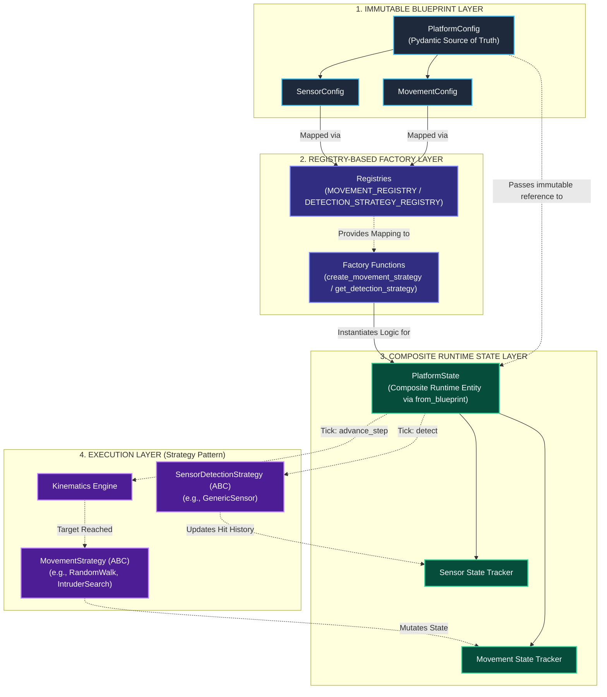
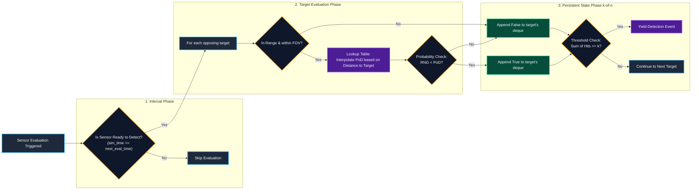
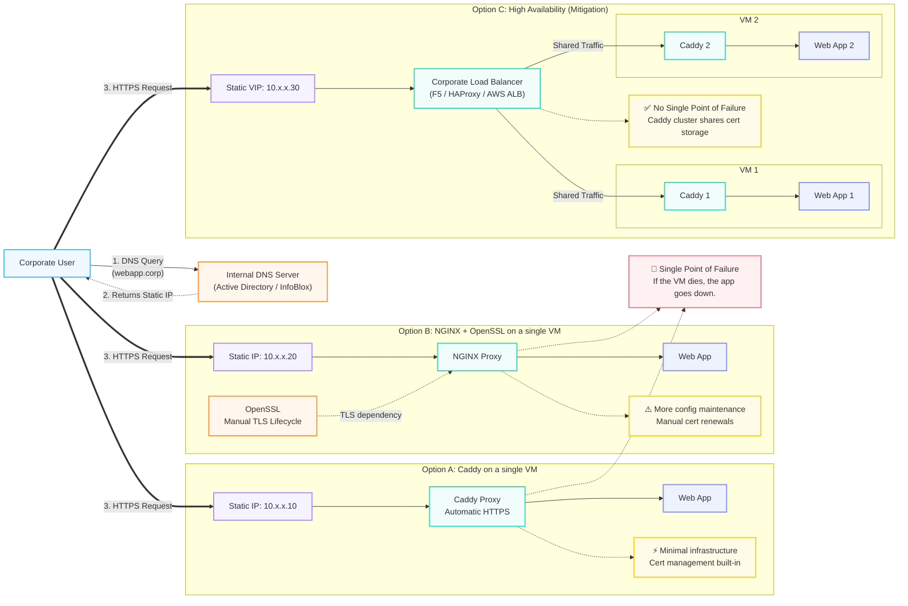

```mermaid
flowchart TD
    classDef immutable fill:#1e293b,stroke:#38bdf8,stroke-width:2px,color:#f8fafc;
    classDef factory fill:#312e81,stroke:#818cf8,stroke-width:2px,color:#f8fafc;
    classDef runtime fill:#064e3b,stroke:#34d399,stroke-width:2px,color:#f8fafc;
    classDef logic fill:#4c1d95,stroke:#c084fc,stroke-width:2px,color:#f8fafc;

    subgraph ConfigLayer["1. IMMUTABLE BLUEPRINT LAYER"]
        PC["PlatformConfig<br/>(Pydantic Source of Truth)"]:::immutable
        MC["MovementConfig"]:::immutable
        SC["SensorConfig"]:::immutable
        PC --> MC & SC
    end

    subgraph FactoryLayer["2. REGISTRY-BASED FACTORY LAYER"]
        Reg["Registries<br/>(MOVEMENT_REGISTRY / DETECTION_STRATEGY_REGISTRY)"]:::factory
        Fact["Factory Functions<br/>(create_movement_strategy / get_detection_strategy)"]:::factory
        Reg -.->|Provides Mapping to| Fact
    end

    subgraph RuntimeLayer["3. COMPOSITE RUNTIME STATE LAYER"]
        PS["PlatformState<br/>(Composite Runtime Entity via from_blueprint)"]:::runtime
        MS["Movement State Tracker"]:::runtime
        SRS["Sensor State Tracker"]:::runtime
    end

    subgraph ExecutionLayer["4. EXECUTION LAYER (Strategy Pattern)"]
        MStrat["MovementStrategy (ABC)<br/>(e.g., RandomWalk, IntruderSearch)"]:::logic
        Kinematics["Kinematics Engine"]:::logic
        SStrat["SensorDetectionStrategy (ABC)<br/>(e.g., GenericSensor)"]:::logic
    end

    %% Flow Connections
    PC -.->|Passes immutable reference to| PS
    MC & SC -->|Mapped via| Reg
    
    Fact -->|Instantiates Logic for| PS
    
    PS --> MS & SRS
    
    %% Execution Loop
    PS -.->|Tick: advance_step| Kinematics
    Kinematics -.->|Target Reached| MStrat
    MStrat -.->|Mutates State| MS
    
    PS -.->|Tick: detect| SStrat
    SStrat -.->|Updates Hit History| SRS
```

```mermaid
flowchart TD
    classDef orchestrator fill:#1e293b,stroke:#38bdf8,stroke-width:2px,color:#f8fafc;
    classDef strategy fill:#312e81,stroke:#818cf8,stroke-width:2px,color:#f8fafc;
    classDef decision fill:#0f172a,stroke:#f59e0b,stroke-width:2px,color:#f8fafc;
    classDef state fill:#064e3b,stroke:#34d399,stroke-width:2px,color:#f8fafc;
    classDef output fill:#4c1d95,stroke:#c084fc,stroke-width:2px,color:#f8fafc;

    subgraph SimulationLoop["1. SIMULATION TICK ORCHESTRATION"]
        Tick["monte_carlo.py (Step Loop)"]:::orchestrator
        Pipeline["detect(platform_states, sim_time_sec, rng)"]:::orchestrator
        Pairs["iter_platform_sensors()<br/>• Filters detecting platforms with sensors<br/>• Finds opposing team targets (team A vs team B)"]:::orchestrator
        
        Tick -->|Each Timestep| Pipeline
        Pipeline --> Pairs
    end

    subgraph FactoryRegistry["2. STRATEGY RESOLUTION"]
        Registry["DETECTION_STRATEGY_REGISTRY<br/>get_strategy(sensor.type)"]:::strategy
        Strategy["GenericSensorDetectionStrategy.detect()"]:::strategy
        
        Pairs -->|For each Platform, Sensor, Target| Registry
        Registry -->|Resolves Strategy| Strategy
    end

    subgraph IntervalCheck["3. SENSOR INTERVAL TIMING (Per-Sensor State)"]
        StateLookup["Lookup / Init SensorRuntimeState<br/>(on detecting_platform.sensor_states[id(sensor)])"]:::state
        IntervalCond{"sim_time >= next_eval_time_sec?"}:::decision
        SkipInterval["Exit early (Sensor not ready to pulse)"]:::orchestrator
        UpdateTimer["next_eval_time_sec = sim_time + interval_time_sec"]:::state

        Strategy --> StateLookup
        StateLookup --> IntervalCond
        IntervalCond -- No --> SkipInterval
        IntervalCond -- Yes --> UpdateTimer
    end

    subgraph TargetEvaluation["4. EXHAUSTIVE TARGET EVALUATION LOOP"]
        TargetLoop["For each Opposing Target Platform"]:::orchestrator
        CalcDist["Calculate Euclidean Distance (distance_m)"]:::strategy
        GetWindow["Get Target Sliding Window<br/>state.get_window(target.id, maxlen=sensor.n)"]:::state

        UpdateTimer --> TargetLoop
        TargetLoop --> CalcDist
        CalcDist --> GetWindow

        RangeCond{"distance_m <= max(sensor.x_values)?"}:::decision
        FOVCond{"Target in FOV?<br/>(Bearing relative to Heading)"}:::decision
        RecordMiss["window.append(False)"]:::state

        GetWindow --> RangeCond
        RangeCond -- No (Out of Range) --> RecordMiss
        RangeCond -- Yes --> FOVCond
        FOVCond -- No (Out of FOV) --> RecordMiss

        CalcPoD["Interpolate PoD from Table<br/>pod = np.interp(distance_m, x_values, pod)"]:::strategy
        RollRNG{"RNG.random() < pod?"}:::decision
        RecordHit["window.append(True)"]:::state

        FOVCond -- Yes --> CalcPoD
        CalcPoD --> RollRNG
        RollRNG -- Miss --> RecordMiss
        RollRNG -- Hit --> RecordHit

        KofNCond{"sum(window) >= sensor.k?"}:::decision
        EmitEvent["Yield DetectionEvent<br/>(detecting_id, target_id, sensor_name, distance_m)"]:::output
        NoEvent["No Event (Threshold not met)"]:::orchestrator

        RecordMiss --> KofNCond
        RecordHit --> KofNCond
        KofNCond -- Yes (Detected!) --> EmitEvent
        KofNCond -- No --> NoEvent
    end

    subgraph SimulationOutcome["5. OUTCOME & END CONDITIONS"]
        OutcomePos["OutcomePositionManager<br/>(Record detection snapshot)"]:::output
        OutcomeDet["OutcomeDetectionManager<br/>(Record detection event)"]:::output
        EndCheck["check_end_conditions()<br/>(initial_detection / team_detection)"]:::output

        EmitEvent --> OutcomePos
        EmitEvent --> OutcomeDet
        EmitEvent --> EndCheck
    end

```

```mermaid
flowchart LR
    classDef orchestrator fill:#1e293b,stroke:#38bdf8,stroke-width:2px,color:#f8fafc;
    classDef decision fill:#0f172a,stroke:#f59e0b,stroke-width:2px,color:#f8fafc;
    classDef math fill:#4c1d95,stroke:#c084fc,stroke-width:2px,color:#f8fafc;
    classDef state fill:#064e3b,stroke:#34d399,stroke-width:2px,color:#f8fafc;

    Start["Sensor Evaluation Triggered"]:::orchestrator --> TimeCheck

    subgraph 1. Interval Phase
        TimeCheck{"Is Sensor Ready to Detect?<br/>(sim_time >= next_eval_time)"}:::decision
        Skip["Skip Evaluation"]:::orchestrator
        TimeCheck -- No --> Skip
    end

    subgraph 2. Target Evaluation Phase
        Loop["For each opposing target"]:::orchestrator
        TimeCheck -- Yes --> Loop
        
        GeoCheck{"In Range & within FOV?"}:::decision
        Loop --> GeoCheck
        
        PoD["Lookup Table:<br/>Interpolate PoD based on Distance to Target"]:::math
        GeoCheck -- Yes --> PoD
        
        Roll{"Probability Check:<br/>RNG < PoD?"}:::decision
        PoD --> Roll
    end

    subgraph 3. Persistent State Phase k-of-n
        RecordMiss["Append False to target's deque"]:::state
        RecordHit["Append True to target's deque"]:::state
        
        GeoCheck -- No --> RecordMiss
        Roll -- No --> RecordMiss
        Roll -- Yes --> RecordHit
        
        KofN{"Threshold Check:<br/>Sum of Hits >= k?"}:::decision
        RecordMiss --> KofN
        RecordHit --> KofN
        
        Detect["Yield Detection Event"]:::math
        Next["Continue to Next Target"]:::orchestrator
        
        KofN -- Yes --> Detect
        KofN -- No --> Next
    end
```

```mermaid
flowchart LR
    Client["Corporate User"]

    %% Option A
    subgraph CaddyOption["Option A: Caddy on a single VM"]
        direction TB
        CaddyIP["Static IP: 10.x.x.10"]:::network
        Caddy["Caddy Proxy<br>Automatic HTTPS"]:::proxy
        CaddyApp["Web App"]:::app
        
        CaddyIP --> Caddy --> CaddyApp
        CaddyNote["⚡ Minimal infrastructure<br>Cert management built-in"]:::note
        Caddy -.-> CaddyNote
    end

    %% Option B
    subgraph NginxOption["Option B: NGINX + OpenSSL on a single VM"]
        direction TB
        NginxIP["Static IP: 10.x.x.20"]:::network
        Nginx["NGINX Proxy"]:::proxy
        OpenSSL["OpenSSL<br>Manual TLS Lifecycle"]:::dependency
        NginxApp["Web App"]:::app
        
        NginxIP --> Nginx --> NginxApp
        OpenSSL -. "TLS dependency" .-> Nginx
        NginxNote["⚠️ More config maintenance<br>Manual cert renewals"]:::note
        Nginx -.-> NginxNote
    end

    %% Option C (Mitigation)
    subgraph MitigatedOption["Option C: High Availability (Mitigation)"]
        direction TB
        LPIP["Static VIP: 10.x.x.30"]:::network
        LB["Corporate Load Balancer<br>(F5 / HAProxy / AWS ALB)"]:::proxy
        
        subgraph VM1["VM 1"]
            Caddy1["Caddy 1"]:::proxy --> App1["Web App 1"]:::app
        end
        subgraph VM2["VM 2"]
            Caddy2["Caddy 2"]:::proxy --> App2["Web App 2"]:::app
        end
        
        LPIP --> LB
        LB -->|Shared Traffic| Caddy1
        LB -->|Shared Traffic| Caddy2
        MitigatedNote["✅ No Single Point of Failure<br>Caddy cluster shares cert storage"]:::note
        LB -.-> MitigatedNote
    end

    %% Shared Corporate Infrastructure
    DNS["Internal DNS Server<br>(Active Directory / InfoBlox)"]:::dns

    %% Network Flow Interactions
    Client -->|"1. DNS Query<br>(webapp.corp)"| DNS
    DNS -.->|"2. Returns Static IP"| Client
    
    Client ==>|"3. HTTPS Request"| CaddyIP
    Client ==>|"3. HTTPS Request"| NginxIP
    Client ==>|"3. HTTPS Request"| LPIP

    Gap["🛑 Single Point of Failure<br>If the VM dies, the app goes down."]:::risk
    Caddy -.-> Gap
    Nginx -.-> Gap

    %% Styles
    classDef client fill:#f0f9ff,stroke:#38bdf8,stroke-width:2px
    classDef dns fill:#fff7ed,stroke:#fb923c,stroke-width:2px
    classDef network fill:#f5f3ff,stroke:#a78bfa,stroke-width:2px
    classDef proxy fill:#f0fdfa,stroke:#2dd4bf,stroke-width:2px
    classDef app fill:#eef2ff,stroke:#818cf8,stroke-width:2px
    classDef dependency fill:#fff7ed,stroke:#fb923c,stroke-width:2px
    classDef note fill:#fefce8,stroke:#facc15,stroke-width:2px
    classDef risk fill:#fff1f2,stroke:#fb7185,stroke-width:2px

    class Client client
    class DNS dns

```