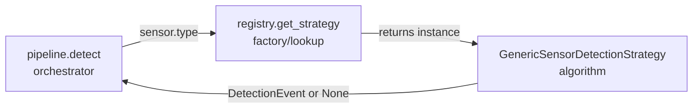

## Why this structure

Think of it as answering one question: **"When a new sensor type shows up, what should have to change?"** The answer should be "add one file, register one line" — never touch the orchestrator.

### The core problem with the old code

```python
def detect(platform_states, current_time_sec):
    # 3. Determine type of sensor: [Generic, Special or Future]
    # 4. execute detection logic based on sensor type
```

If this were implemented literally, it'd become an `if/elif` chain:

```python
if sensor.type == "generic":
    ... 40 lines of PoD/FOV/k-of-n logic ...
elif sensor.type == "specific":
    ... 40 more lines ...
elif sensor.type == "future_type":
    ... 40 more lines ...
```

That's the classic violation: `detect()` grows a new branch, and risks breaking existing branches, every time you add a sensor type. That's what Strategy pattern exists to kill.

### The mental model: 3 layers, each with one job



1. **`pipeline.py` (orchestrator)** — knows *who* gets a chance to detect (loop platforms, skip if no sensor, build opposing targets). It does **not** know *how* any sensor detects. It just says "here's a sensor, here's who to check against — you figure out the rest" to whatever strategy comes back.

2. **`registry.py` (factory/lookup)** — the only place that maps a string (`sensor.type`) to a concrete class. This is a dict, not an if/elif, so adding a type is:
   ```python
   _STRATEGIES = {
       "generic": GenericSensorDetectionStrategy(),
       "specific": SpecificSensorDetectionStrategy(),  # <- just this
   }
   ```

3. **`base.py` (contract) + `generic.py` (algorithm)** — `SensorDetectionStrategy` is the abstract shape every algorithm must have (one method: `detect(...)`). `GenericSensorDetectionStrategy` is the only place that actually knows about FOV, PoD, sliding windows, k-of-n. If that logic is wrong, you edit exactly one file, and no other sensor type's code is at risk.

### Why not just put `detect()` methods on the Pydantic schema classes?

You might notice `movement.py` already does this — `RandomWalkMovement.get_next_position()` lives on the schema itself. I deliberately did **not** copy that for sensors, because:

- `SensorConfig` is a **data contract** (validated user config: `k`, `n`, `pod`, `x_values`...). Mixing in detection *behavior* (which needs `random_gen`, other platforms, sliding-window state across timesteps) turns a config object into a god-object doing two jobs — validation and simulation logic. That's a Single Responsibility violation waiting to bite you once k-of-n needs to track history per platform-pair.
- Keeping strategies external means the detection algorithm can hold/receive whatever runtime state it needs (e.g. a future sliding-window tracker) without polluting the schema that's also used for YAML validation and UI forms.

### Where each SOLID letter shows up concretely

| Principle | Where |
|---|---|
| **S**RP | `SensorConfig` = data only. `Strategy` classes = behavior only. |
| **O**CP | New sensor type = new file + one registry line. `pipeline.py` never changes. |
| **L**SP | Any `SensorDetectionStrategy` subclass can replace another; `pipeline.py` just calls `.detect(...)` uniformly. |
| **I**SP | The interface has exactly one method — no strategy is forced to implement things it doesn't need. |
| **D**IP | `pipeline.py` depends on the abstract `SensorDetectionStrategy`, not on `GenericSensorDetectionStrategy` directly — that binding happens only inside `registry.py`. |

If you want, I can sketch what a second sensor type (`specific`) would look like end-to-end to make the "just add a file" claim concrete.