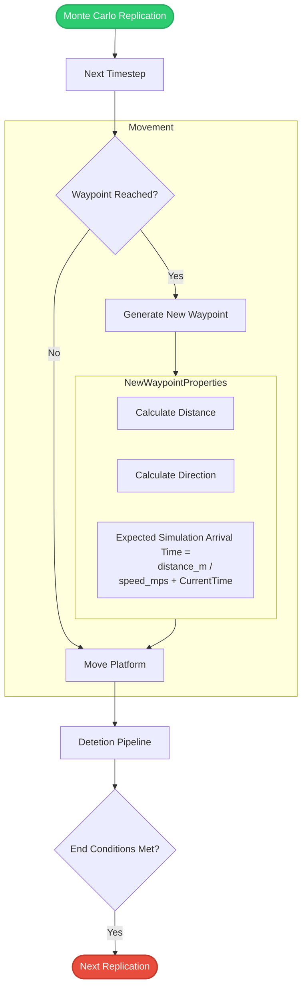
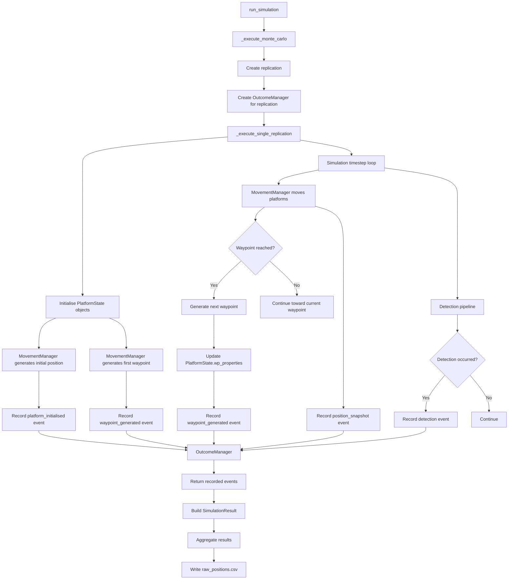

# Movement manager

```mermaid
flowchart TD

M([Monte Carlo Replication])
E{End Conditions Met?}
T[Next Timestep]
Det[Detetion Pipeline]
Rep([Next Replication])


subgraph Movement
    W{Waypoint Reached?}

    W -- Yes --> G[Generate New Waypoint]
    W -- No --> Move[Move Platform]

    subgraph NewWaypointProperties
        D[Calculate Distance]
        Dir[Calculate Direction]
        Arrival[Expected Simulation Arrival Time =
        distance_m / speed_mps + CurrentTime]
    end

    NewWaypointProperties --> Move
end


M --> T 
T --> W
G --> NewWaypointProperties
Move --> Det
Det --> E


E -- Yes --> Rep

%% Custom Styles
style M fill:#2ecc71,stroke:#27ae60,stroke-width:2px,color:#fff
style Rep fill:#e74c3c,stroke:#c0392b,stroke-width:2px,color:#fff

```

# Outcome Manager

```mermaid
flowchart TD
    A[run_simulation] --> B[_execute_monte_carlo]

    B --> C[Create replication]
    C --> D[Create OutcomeManager for replication]
    D --> E[_execute_single_replication]

    E --> F[Initialise PlatformState objects]
    F --> G[MovementManager generates initial position]
    F --> H[MovementManager generates first waypoint]

    G --> I[Record platform_initialised event]
    H --> J[Record waypoint_generated event]

    I --> K[OutcomeManager]
    J --> K

    E --> L[Simulation timestep loop]
    L --> M[MovementManager moves platforms]

    M --> N{Waypoint reached?}
    N -->|Yes| O[Generate next waypoint]
    O --> P[Update PlatformState.wp_properties]
    P --> Q[Record waypoint_generated event]
    Q --> K

    N -->|No| R[Continue toward current waypoint]

    M --> S[Record position_snapshot event]
    S --> K

    L --> T[Detection pipeline]
    T --> U{Detection occurred?}
    U -->|Yes| V[Record detection event]
    V --> K
    U -->|No| W[Continue]

    K --> X[Return recorded events]
    X --> Y[Build SimulationResult]
    Y --> Z[Aggregate results]
    Z --> AA[Write raw_positions.csv]
```