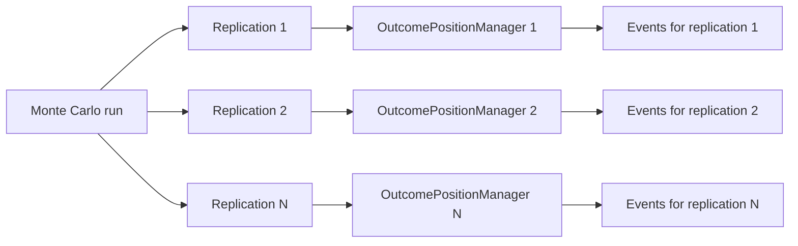
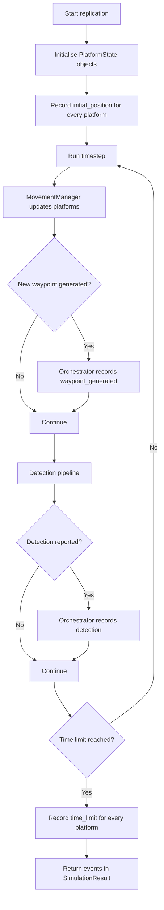
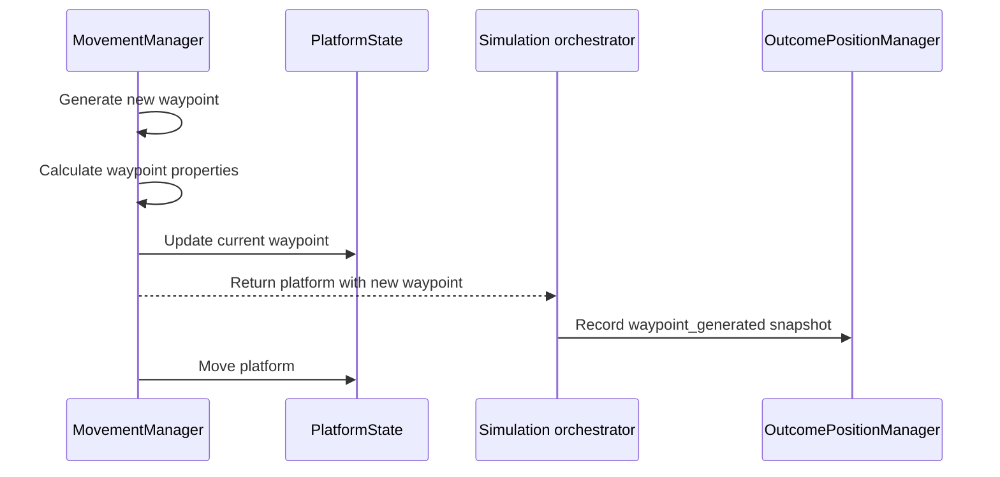
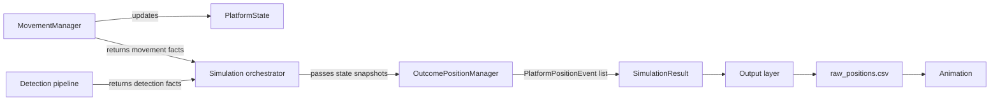
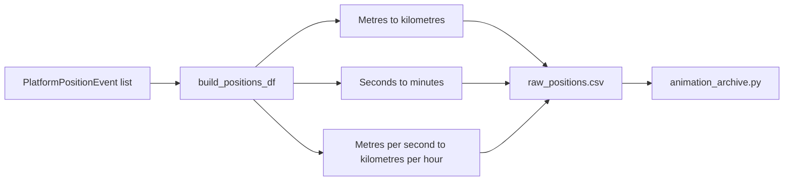

# OutcomePositionManager

## Purpose

`OutcomePositionManager` records platform position snapshots during one Monte Carlo replication. It gives the simulation a consistent event history that can later be converted into `raw_positions.csv` and used by the animation.

The manager records state; it does not control state.

- `MovementManager` generates waypoints and moves platforms.
- The detection pipeline determines whether a detection occurred.
- The simulation orchestrator decides when a snapshot should be captured.
- `OutcomePositionManager` stores snapshots.
- The output layer converts snapshots into CSV columns and units.

## Replication scope

A new manager is created for every replication:

This prevents events from different replications being mixed. It also means the manager can start empty and be discarded after its replication result has been created.

## Events recorded

The manager captures four types of `PlatformPositionEvent`:

| Event | When it is recorded | Platforms recorded |
|---|---|---|
| `initial_position` | After platform states and their first waypoints are created | All platforms |
| `waypoint_generated` | After a new waypoint has been assigned to a platform | The platform receiving the waypoint |
| `detection` | When the detection pipeline reports a detection | The detecting platform |
| `time_limit` | When the simulation reaches its time limit | All platforms |

Each event contains a snapshot of the platform's position, current waypoint, heading, speed, team, status, timestamp, and optional detection metadata.

The snapshot contains scalar values rather than a reference to the mutable `PlatformState`. Later movement therefore cannot change an event that has already been recorded.

## Event lifecycle

## Ordering rule

Record a snapshot after the relevant state change:

This ensures a `waypoint_generated` event contains the new waypoint, not the previous one. The platform position is the position at which the new waypoint was assigned.

## Responsibilities and coupling

`MovementManager` must remain independent of output code. It must not import or call `OutcomePositionManager`, write CSV files, or construct output events. Instead, it returns movement facts to the orchestrator, such as which platforms received new waypoints.

The manager is therefore an output-side collector, not part of the movement or detection domain logic.

## Output flow

Events use internal SI units:

- positions and waypoints: metres;
- speed: metres per second;
- timestamp: seconds.

`OutcomePositionManager` does not convert units. The output layer performs these conversions when creating `raw_positions.csv`:

The event type is retained internally so the reason for each row is known. CSV formatting may omit that field when maintaining the existing file format.

## Current integration boundary

The initial position, waypoint-generated, and time-limit events are recorded by the simulation orchestrator. Detection events should be recorded when the detection pipeline exposes a result containing:

- detecting platform;
- target platform;
- sensor name;
- detection distance;
- detection timestamp.

Until that interface exists, the manager supports detection events but the simulation cannot populate them automatically.
